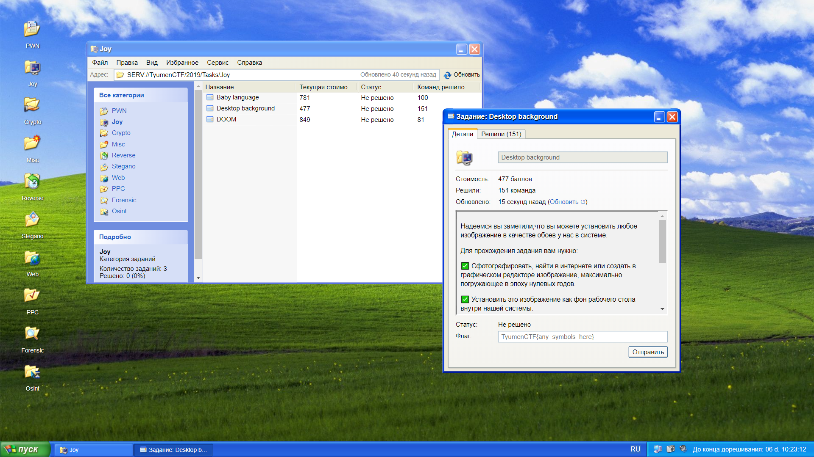

# 🔐⚔️ TyumenCTF 2019 Frontend
Фронтенд прошедших соревнований по информационной безопасности TyumenCTF 2019. Код без бекенда и серверного взаимодействия, запросы подменены на демонстрационные данные.

  

Тем не менее, сохранились возможности:
* поиграть в DOS-игры (раздел в меню Пуск);
* сменить обои рабочего стола;
* поработать с множеством окон прямо в вебе;
* окунуться в атмосферу времен Windows XP.

Онлайн демонстрация: [DEMO](http://shevchux.github.io/tyumenctf-2019-front).

--------
Подробнее о проекте [в группе ВКонтакте](https://vk.com/tyumenctf).
